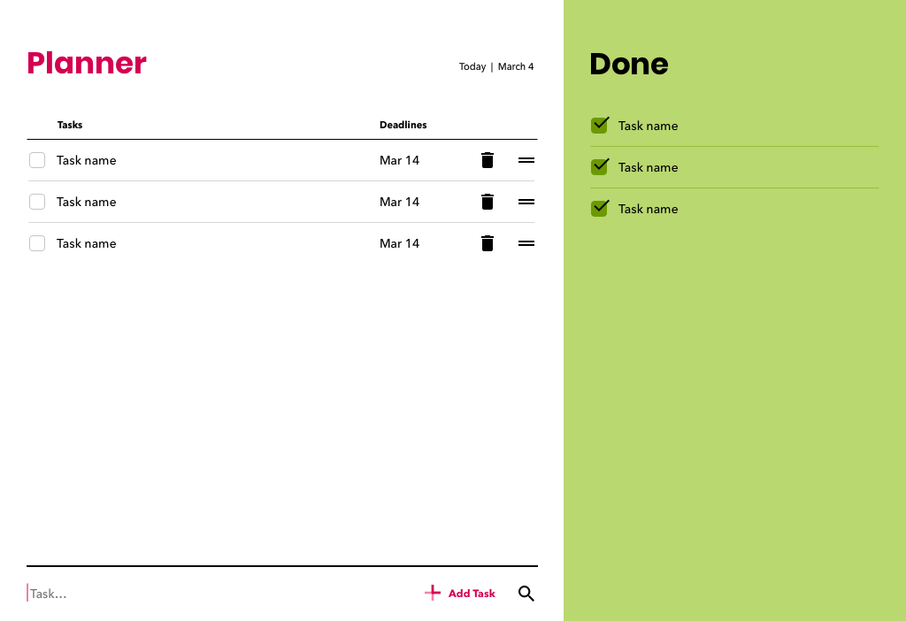
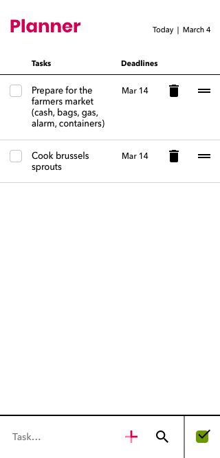
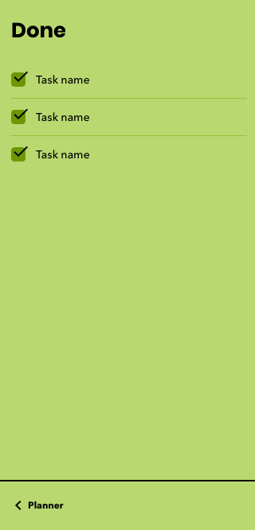

<!-- START doctoc generated TOC please keep comment here to allow auto update -->
<!-- DON'T EDIT THIS SECTION, INSTEAD RE-RUN doctoc TO UPDATE -->

- [Planner](#planner)
  - [Description](#description)
  - [Design for desktop](#design-for-desktop)
  - [Design for mobile](#design-for-mobile)
  - [References](#references)
  - [Tech used](#tech-used)
  - [App features](#app-features)
    - [Edit task](#edit-task)
    - [Edit tasks done](#edit-tasks-done)
    - [Empty states](#empty-states)
    - [Sorting tasks](#sorting-tasks)
    - [Local storage](#local-storage)
    - [Today's date and time](#todays-date-and-time)
    - [Responsive features](#responsive-features)
      - [Notes on responsive design](#notes-on-responsive-design)
  - [Things to improve](#things-to-improve)

<!-- END doctoc generated TOC please keep comment here to allow auto update -->

# Planner

## Description

Responsive web application to plan, organize and track tasks.

## Design for desktop

## Design for mobile

## References

- https://coryrylan.com/blog/javascript-es6-class-syntax

## Tech used

- CSS grid and CSS Flexbox for page layouts.
- CSS Variables.
- CSS and JS media queries for responsive design.
- ES6 (template literals, arrow functions, classes, modules, spread syntax,
  multiline strings, let and const).
- Webpack
- Eslint
- JS event delegation
- JS events (keyboard events, mouse events, form events, resource
  events).
- DOM manipulation.
- `sort()` function with compare function.

## App features

### Edit task

- **Add a task** (by using keyboard shortcut Enter or a "+ Add task" button).
  - **Task highlighting** - When task is added, it's background will be
    highlighted light gray. This helps to identify the added task from the
    rest of the tasks if more than one task is present.
- **Mark task done**
  - **Checkbox** - If user hovers over empty checkbox, checked icon will
    appear. This is to visually indicate that task will marked done if checkbox is
    clicked.
- **Edit task text**
- **Add a priority to a task (P0, P1 or P2)**
- **Add a deadline to a task**
- **Delete a task**

  - Click on the trash bin icon.
  - Remove all text inside of task and click out of the textarea.

### Edit tasks done

- **Mark task undone**
  - **Checkbox** - If user hovers over checked checkbox, arrow pointing left
    icon will appear. This is to visually indicate that task will marked undone
    and move back to left side of the screen if checked checkbox is clicked.
- **Delete a task done**
  - Remove a task text and click out of the text area.

### Empty states

If there are no tasks are present in the planner section, then empty state will
appear stating that the user has no tasks and can add a task below on the screen.

Same works for done tasks section. If no tasks are present, then empty state
will appear stating that tasks that get done will appear in this section.

### Sorting tasks

Sort tasks by priority or by deadline. I am using array `sort()` with compare function.

### Local storage

The app stores tasks, tasks done and states in local storage.

States are:

- How the tasks are sorted, by priority or by deadline.
- If browser viewport is <= 800px, then user sees one section on screen,
  either planner with tasks or done section with tasks done.
- If browser viewport is >= 801px, then user sees two sections on screen,
  both planner and done.

### Today's date and time

Today's date and time appear on the right top area above the tasks. This is
to make setting deadlines for tasks easier.

### Responsive features

I created **6 media query breakpoints** based on _usability_ and _aesthetics_ of
the web app. Maximum design width is set to 1400px.

- **Viewport >= 801px**
  - The viewport will show two sections, planner and done, at the same time.
- **Viewport <= 800px**
  - New button with a checkbox icon to view done tasks is made visible with CSS.
  - The viewport will show only one section, planner or done, at the time.
    Which panel is shown depends on what state is stored on local storage. JS
    checks the local storage and if the checkbox icon button has been
    clicked then done tasks section is visible and if not, then tasks
    section is visible.
  - Extra padding is added for clickable table headings.
  - "+ Add task" button is removed with CSS.
  - Smaller version of "+ Add task" button is made visible with CSS.
- **Viewport <= 550px (minor breakpoint)**
  - Minor aesthetics changes.
- **Viewport <= 500px**
  - Task layout changes. The viewport has become too small to have checkbox,
    task text, priority, deadline and delete icon all in the same line. So I
    used CSS grid to break content from one line into two lines. First line has
    checkbox and task text. Second line has priority, deadline and delete icon.
- **Viewport >= 361px**
  - In JS I check the local storage how tasks are sorted and then paint the
    new tasks heading that has correct sorted by highlighted by an arrow down.
- **Viewport <= 360px**

  - Tasks headings are hidden in CSS.
  - Dropdown to sort tasks is made visible in CSS.
  - In JS I check the local storage how tasks are sorted and then paint the
    sorted by dropdown with that value selected.

#### Notes on responsive design

**Design mobile first**

- I designed the largest viewport design first, because I
  had already in
  mind how the smallest viewport will look like. I recommend designing
  smallest viewport design first. If you can make something work for a small
  viewport, then it's much easier to generate a large viewport version of
  the same design.

**Use tools to test usability in mobile devices**

- As a designer, use tools like
  [Skala Preview](https://bjango.com/mac/skalapreview/) to make sure that fonts and clickable areas are
  large enough for Android and iOS phones.

- As a developer, use Chrome Dev Tools to debug the web app on a remote
  device like a smart phone. To debug in Chrome Dev Tools:
  - Plug in your phone to your computer. Make sure USB debugging is connected
    on Android. Open Chrome on your phone.
  - Open Chrome Dev Tools on your computer.
  - Click on the overflow icon (three vertical dots) on top right corner.
    - More tools -> Remote devices
    - Wait until my device appears in Remote devices tab on the bottom of the
      dev tools section.
    - In Port forwarding section add a rule `localhost:8080` or whatever
      network port Webpack uses to run the code.
    - On the left hand of the dev tools under "Devices", click on the device
      you are testing on.
    - Enter the `localhost:8080` or whatever port you use and click Open.
    - Click on Inspect button beside `localhost:8080`.

## Things to improve

- Keyboard shortcut (Shift + Enter) for exiting task after finishing editing
  task text.
- Allow users to create a profile and store the data using Firebase.
- Custom build and design date picker that looks the same in all browsers.
- Add a button "Add deadline" instead of "mm/dd/yyyy 🔽" in web and empty area
  with 🔽 icon in Android web.
- Format date into month and day (e.g. Dec 15).
- Add CSS animation.
- Add option to add multiple lists and a search all lists feature.
- Add option to rearrange tasks by drag and drop.
